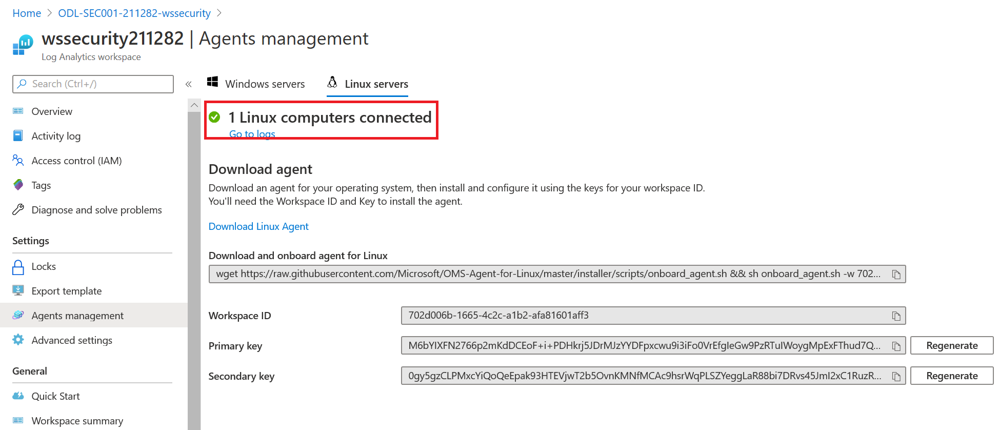
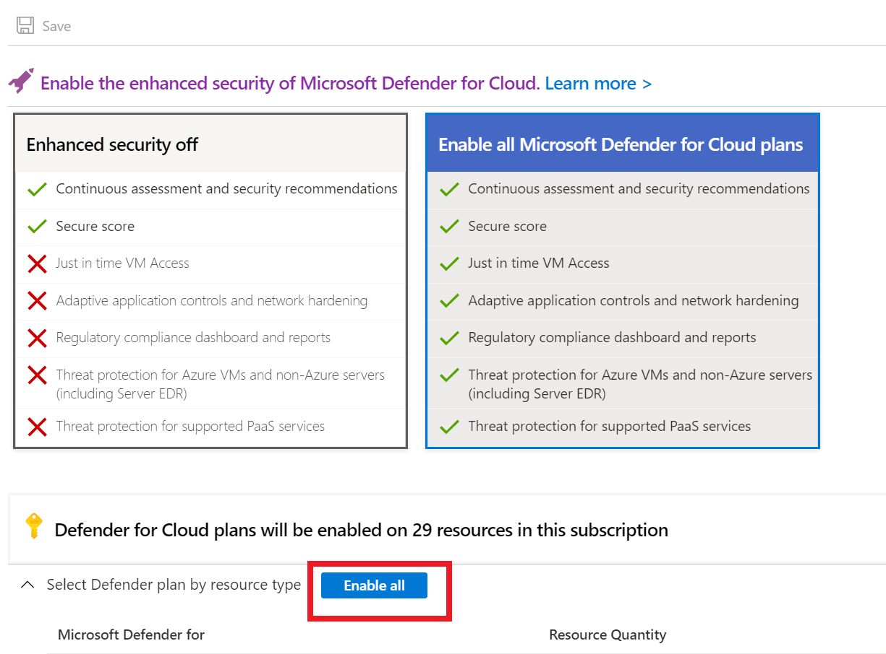

# Microsoft Defender for Cloud Setup : Lab 1 : Setup

## Exercise 1: Log Analytics Solutions with Microsoft Defender for Cloud

Duration: 60 minutes

Synopsis: Microsoft Defender for Cloud provides several advanced security and threat detection abilities that are not enabled by default. In this exercise we will explore and enable several of them.

### Task 0: Setup Microsoft Defender for Cloud

1. Open the [Azure Portal](https://portal.azure.com/#home)
2. In the global search, search for **Microsoft Defender for Cloud**, select it

    

3. If you are presented with the getting started page, select both the subscription and the log analytics workspace, then select **Upgrade**, otherwise skip to Task 1.

    

    > **NOTE** Due to the lab environment, your Microsoft Defender for Cloud may already be upgraded and this step may not be necessary.

    > **NOTE** If you do not see the workspace, continue on and we will enable it in a later step.

4. Select **Continue without installing agents**

    

5. Under **General**, select **Security Alerts**, IF prompted, select **Try Advanced threat detection**
      - Select the **wssecuritySUFFIX** workspace
      - Select **Upgrade**
      - Select **Continue without installing agents**

6. Select **Overview**, if prompted, select the **You may be viewing limited information. To get tenant-wide visibility, click here**

    

7. Select the **Security Admin** role

    

8. Select **Get access**

### Task 1: Linux VM and Microsoft Monitoring Agent (MMA) manual install

1. In the Azure Portal, browse to your ***-security** resource group, then select the **wssecuritySUFFIX** **Log Analytics Workspace**.

    

2. In the blade, under **Settings**, select **Agents Management**.

3. Record the `Workspace ID` and the `Primary key` values.

   

4. In the Azure Portal, browse to the **wssecurity-SUFFIX-paw-1** virtual machine and select it.  Note that you may need to start the VMs if they have been stopped.
5. Select **Connect->RDP**, then select **Download RDP File**.  Open the file to start an RDP connection.
6. Login to the **wssecuritySUFFIX-paw-1** virtual machine using the `wsuser` username and the lab password.
7. Open a Windows PowerShell window and run the following to login to the **wssecurity-SUFFIX-linux-1** (you may need to verify the IP address of the linux-1 machine first):

    ```PowerShell
    ssh wsuser@10.0.0.5
    ```

    > **NOTE** Make sure the IP is correct, sometimes the IPs can get allocated differently during ARM setup and VM restarts.

8. In the prompt, type **yes**, login using the lab password.  
9. Run the following commands, be sure to replace the workspace tokens with the values you records above:

    ```bash
    wget https://raw.githubusercontent.com/Microsoft/OMS-Agent-for-Linux/master/installer/scripts/onboard_agent.sh && sh onboard_agent.sh -w <YOUR_WORKSPACE_ID> -s <YOUR_WORKSPACE_KEY>

    sudo /opt/microsoft/omsagent/bin/service_control restart <YOUR_WORKSPACE_ID>

    ```

10. Switch back to the Azure Portal.
11. In the blade menu, select **Agents Management** and then select **Linux Servers**, you should see **1 LINUX COMPUTER CONNECTED**.  You have successfully manually deployed the agent, however, deploying manually would be time consuming so we will explore how to setup auto-deployment for newly created resources in future exercises.

    

    > **Note** When auto-provisioning has been enabled, Microsoft Defender for Cloud will assign resources automatically to a default or pre-configured log analytics workspace in your resource group.

### Task 3: Enable change tracking and update management

1. Switch back to the Azure Portal.
2. In the global search menu, type **Virtual Machines**, then select it.
3. Select all the virtual machines that are displayed
4. In the top menu, select **Services**, then select **Change Tracking**.

   

5. Select the **CUSTOM** radio button.
6. Select **change**, select matching region.  Notice that we have already setup the corresponding automation account.

    

    > **NOTE** If you do not pre-link an automation account, this blade dialog will not deploy a link reliability.  You should do this before you create log analytic services. See [Region Mappings](https://docs.microsoft.com/en-us/azure/automation/how-to/region-mappings) for more information.

7. Select the Log Analytics Workspace **wssecuritySUFFIX** that was deployed with the lab ARM template.

    

8. Select all the virtual machines, then select **Enable**.
9. Navigate back to the **Virtual Machines** blade, select all the virtual machines that are displayed.
10. In the top menu, select **Services**, then select **Inventory**.
11. Select the **CUSTOM** radio button.
12. Select **change**, select the **Log Analytics Workspace** that was deployed with the lab ARM template.
13. Notice that all the VMs are already enabled for the workspace based on the last task.

    

14. Navigate back to the **Virtual Machines** blade, select all the virtual machines that are displayed.
15. In the top menu, select **Services**, then select **Update Management**.
16. Select the **CUSTOM** radio button.
17. Select **change**, select the **Log Analytics Workspace** that was deployed with the lab ARM template.
18. Select all the virtual machines, then select **Enable**.
19. Browse to your resource group, then select your **wssecuritySUFFIX** Log Analytics workspace.
20. Under the **General** section, select the **Solutions** blade, you should see the **ChangeTracking** and **Updates** solutions were added to your workspace.
21. Select the **ChangeTracking** solution.

    

22. Under **Workspace Data Sources** section, select **Solution Targeting (Preview)**.

    

23. Remove any scopes that are displayed via the ellipses to the right of the items.
24. Repeat the steps to remove the solution targeting for the **Updates** solution.

    > **NOTE** You must remove the solution targeting before you can move on.  You may need to wait 5-10 minutes before the system will alow you to remove them.

### Task 4: Review MMA configuration

1. Switch to the Remote Desktop Connection to the **wssecuritySUFFIX-paw-1** virtual machine.
2. Open **Event Viewer**.
3. Expand the **Applications and Services Logs**, then select **Operations Manager**.
4. Right-click **Operations Manager**, select **Filter Current Log**.

    

5. For the event id, type **5002**, select the latest entry, you should see similar names to all the solutions that are deployed in your Log Analytics workspace including the ones you just added:

    

    > **NOTE** If you do not see any events, check that you removed the Solution targeting in the setups above.

6. Open **Windows Explorer**, browse to **C:\Program Files\Microsoft Monitoring Agent\Agent\Health Service State\Management Packs** folder

7. Sort by **Modified Date**, notice the management packs that have been downloaded that correspond to the features you deployed from Azure Portal:

    

## Exercise 2: Connecting Azure Activity Logs

Duration: 5 minutes

### Task 1: Connect Azure Activity Log

1. Switch to the Azure Portal
2. Browse to your **wssecuritySUFFIX** Log Analytics workspace
3. Under **Workspace Data Sources**, select **Azure Activity Log**

    

4. Select your lab **Subscription**
5. Select **Connect**

    

6. Navigate back to the activity log data source blade, you should now see `Connected`

    

## Exercise 3: Microsoft Defender for Cloud Settings

Duration: 15 minutes

### Task 1: Microsoft Defender for Cloud Plans

1. In the global navigation search for and select **Microsoft Defender for Cloudr**
2. Under **Management**, select **Environment Settings**
3. Select the lab subscription

    

4. Under **Settings**, select **Defender plans**
5. On the Microsoft Defender for Cloud Plans, if not already selected, select **Enable all Microsoft Defender for Cloud plans**
6. In the Microsoft Defender for Cloud Plans section, if any of the items are not enabled, click **Enable all** then select **Save**

    

7. If prompted, select the **wssecuritySUFFIX** log analytics resource
8. Under **Settings**, select **Security Policy**
9. If you do not see a Microsoft Defender for Cloud default policy assigned, then select **Assign policy**

    

10. Select **Review + create**
11. Select **Create**

12. Navigate back to **Microsoft Defender for Cloud**
13. Under **Management**, select **Environment Settings**
14. Expand the subscription node, select the **wssecuritySUFFIX** workspace
15. Under **Settings**, select the **Defender Plan**, if it is not selected, select **Enable all Microsoft Defender for Cloud Plans**, then select **Save**
16. Under **Settings**, select **Data collection**
17. Select **Common**

    

18. Select **Save**

### Task 2: Auto provisioning

1. Under **Management**, select **Environment Settings**
2. Select the lab subscription
3. Under **Settings**, select **Auto provisioning**.  In a new subscription, you should see all the items are disabled:

    

4. If disabled, toggle the **Log Analytics agent for Azure VMs** to **On**
5. Select the **Connect Azure VMs to a different workspace**
6. Select the **wssecuritySUFFIX** log analytics workspace

    

7. In the dialog, select **Existing and new VMs**

    

8. Select **Apply**
9. Toggle the **Log Analytics agent for Azure Arc Machines** to **On**
10. In the dialog, select the **wssecuritySUFFIX** workspace
11. Select **Apply**
12. Toggle the **Vulnerability assessment for machines** to **On**
13. In the dialog, select the **ASC integrated vulnerability scanner powered by Qualys** workspace
14. Select **Apply**

    

15. Toggle the **Guest Configuration agent** to **On**
16. Toggle the **Microsoft Dependency agent** to **On**
17. Toggle the **Policy Add-on for Kubernetes** to **On**
18. Select **Save**

    

### Task 3: Continuous Export

1. On the Settings page, select **Continuous export**
2. Review the settings on the page, notice that you can send data to an event hub or to another log analytics workspace.

    

3. Select all the **Exported data types**

    

4. For the resource group, select the ***-SUFFIX-security** resource group
5. Select the **wssecuritySUFFIX** namespace
6. Select the **wssecuritySUFFIX** event hub
7. Select the **All** policy.

    

8. Select **Save**

## Exercise 8: Creating Sample Alerts

### Task 1: Create sample alerts

1. Browse back to **Microsoft Defender for Cloud**
2. Under **General**, select **Security alerts**
3. In the top navigation, select **Sample alerts**

    

4. Select **Create sample alerts**, after a few minutes, you should see several security alerts generated:

    

5. Take a few minutes to review a couple of the sample alerts.
6. Once done reviewing, select all the alerts and then select **Change status->Dismiss**

## Reference Links

- [Microsoft Defender for Cloud](https://docs.microsoft.com/en-us/azure/security-center/security-center-intro)
- [Overview of Azure Monitor agents](https://docs.microsoft.com/en-us/azure/azure-monitor/platform/agents-overview)
- [Log Analytics](https://docs.microsoft.com/en-us/azure/azure-monitor/logs/log-analytics-overview)
