# Microsoft Defender for Cloud Setup : Lab 2 : Execute Microsoft Defender for Cloud Protections

## Exercise 1: VM Vulnerability Assessments

### Task 1: VM Vulnerability

1. Switch to the Azure Portal.

2. Open the Azure Security Center

3. Under **Cloud Security**, select **Azure Defender**, then scroll down and select **VM vulnerability assessment**

4. Select the checkbox to select all the virtual machines

    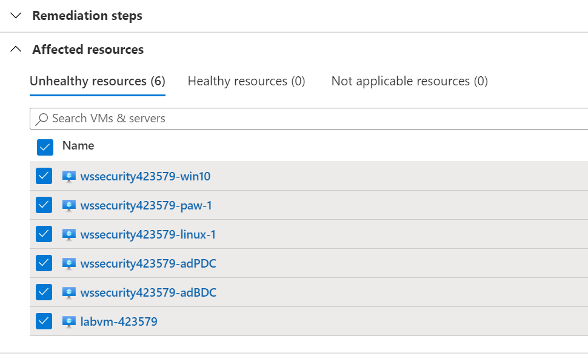

5. Select **Fix**

    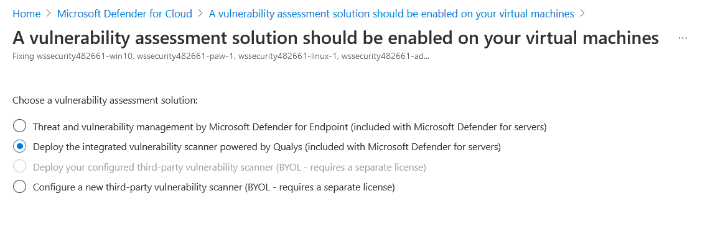

6. Select **Proceed**

7. In the dialog, select **Fix 6 resources**

  > **Note** After a few hours (up to 12), the agent will be installed on all selected machines and the assessment data will start to flow into the Security Center.

## Exercise 2: SQL Vulnerability Assessments

### Task 1: SQL Vulnerability

1. Switch to the Azure Portal and browse to your resource group

2. Browse to the **wssecuritySUFFIX** Azure Database for SQL instance

3. Under **Security**, select **Security Center**, if you see **Enable Azure Defender for SQL**, select it.

4. After a few minutes, you should see the recommendations and security alerts for the single SQL resource (if any)

5. Select the **(Configure)** link

    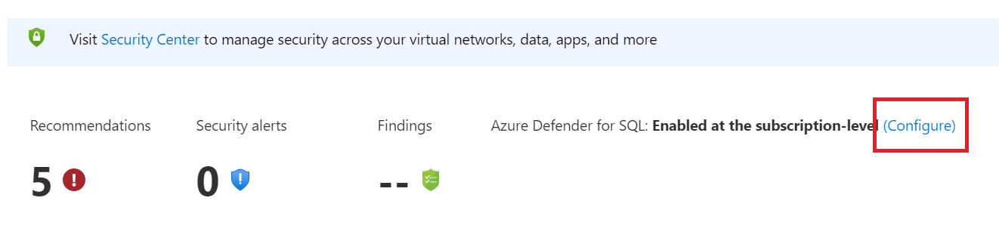

6. Select the **Select storage account** link
  
    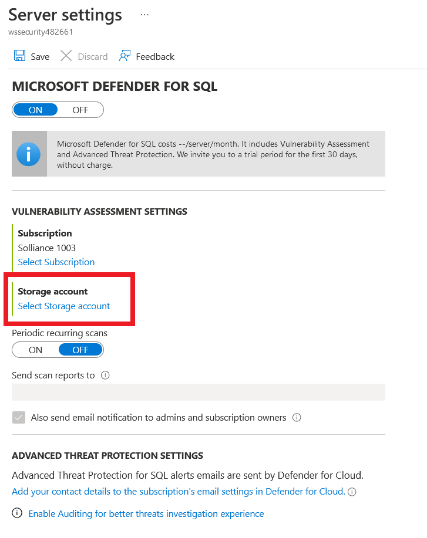

7. Select the **wssecuritySUFFIX** storage account

8. Toggle the periodic recurring checkbox to **On**

9. Set the email to the lab user email

10. Select the **Enable Auditing for better threats investigation experience** link

    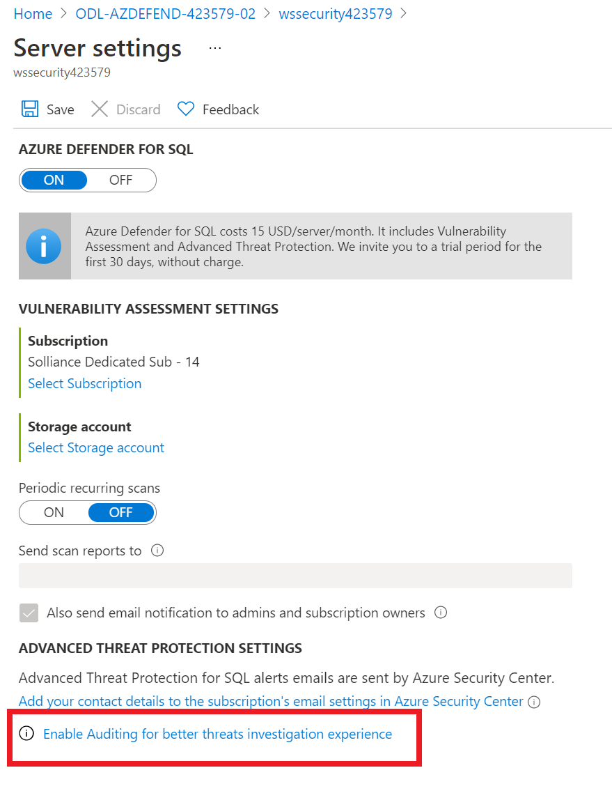

11. Toggle the **Enable Azure SQL Auditing** to **On**

12. Select **Log Analytics** checkbox

13. Select the **wssecuritySUFFIX** log analytics workspace

14. Toggle the **Enable Auditing of Microsoft support operations** to **On**

    

15. Again, select the **Log Analytics** checkbox, then select the lab subscription and the **wssecuritySUFFIX** workspace

16. Select **Save**

17. In the breadcrumb, select **Server settings**

18. Select **Save** again

19. In the Azure Portal, open the Azure Security Center

20. Under **Cloud Security**, select **Azure Defender**

21. Scroll to the bottom, select **SQL Vulnerability Assessment**, after a few minutes, you should see all servers across the subscription displayed.

IMAGE TODO

## Exercise 3: File Integrity Monitoring

### Task 1: File Integrity Monitoring

1. Navigate back to the main Azure Security Center page

2. In the blade menu, under **Cloud Security**, select **Azure Defender**

3. Scroll to the bottom and select **File Integrity Monitoring**.

4. Select the **wssecuritySUFFIX** log workspace. If displayed, select **Upgrade Plan**

   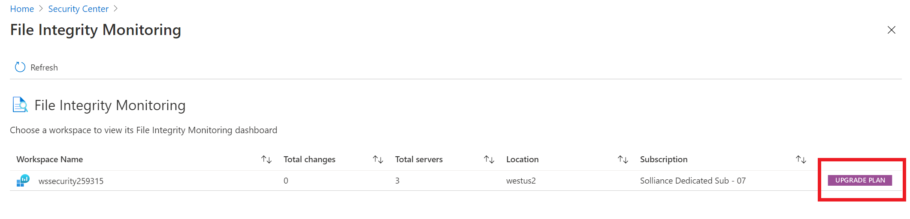

   1. Select **Try File Integrity Monitoring**.

   2. Select the workspace only, then select **Upgrade**.

   3. Select the **Continue without installing agents** link.

      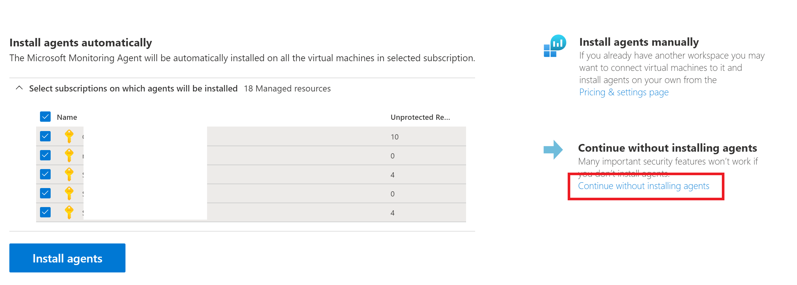

   4. If displayed, select **Enable**, then select **Enable File Integrity Monitoring**. If not displayed, simply select the workspace.

      > **NOTE** This can take some time, but is typically within a few minutes

   5. Refresh the File Integrity Monitoring page
  
5. In the menu, select **Settings**.

    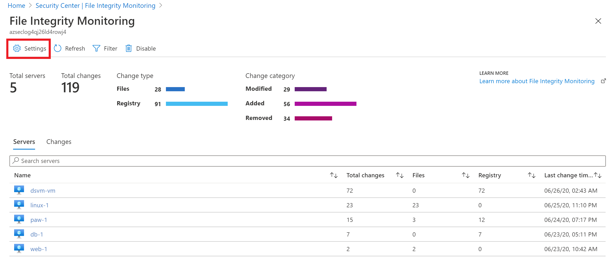

6. Select the **Windows Files** tab.
7. Select **+Add**.
8. For the item name, type **HOSTS**.
9. For the path, type **c:\windows\system32\drivers\etc\\\***.
10. For the path type, select **Folder**
11. Toggle **Recursion** to **On**
12. Toggle **Upload file content** to **True**
13. Select **Save**.

    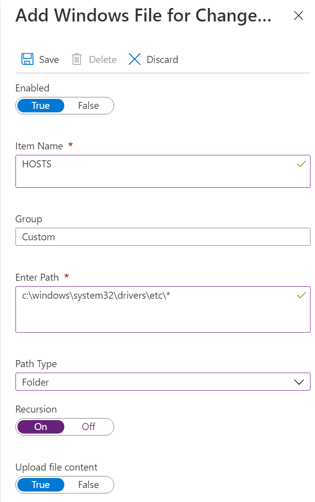

14. Select the **File Content** tab.
15. Select **Link**, then select the storage account tied to your lab.

    > **NOTE** It will take 30-60 minutes for Log Analytics and its management packs to execute on all your VMs. As you may not have that much time with this lab, screen shots are provided as to what results you will eventually get.

    

16. Select **Save**
17. Switch to the Remote Desktop Connection to the **paw-1**.
18. Open the **c:\windows\system32\drivers\etc\hosts** file.
19. Add the following entry:

    ```cmd
    10.0.0.6    linux-2
    ```

20. Save the file.
21. After about 30-60 minutes, the Log Analytics workspace will start to pickup changes to your files, registry settings and windows services.
    - Switch to your Log Analytics workspace
    - Under **General**, select **Logs**
    - Run the following query:

    ```output
    ConfigurationChange
    | where Computer == "paw-1"
    | where ConfigChangeType in("Files", "Registry")
    | order by TimeGenerated
    | render table
    ```

    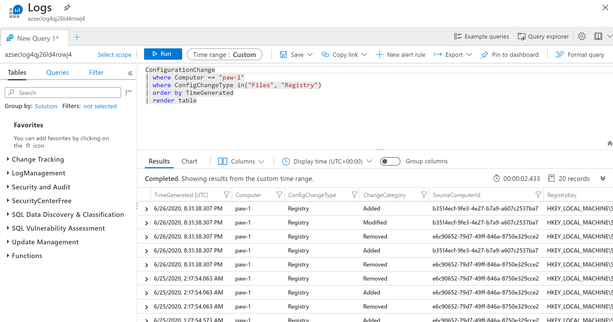

22. You will also start to see the file snapshots show up in the storage account:

    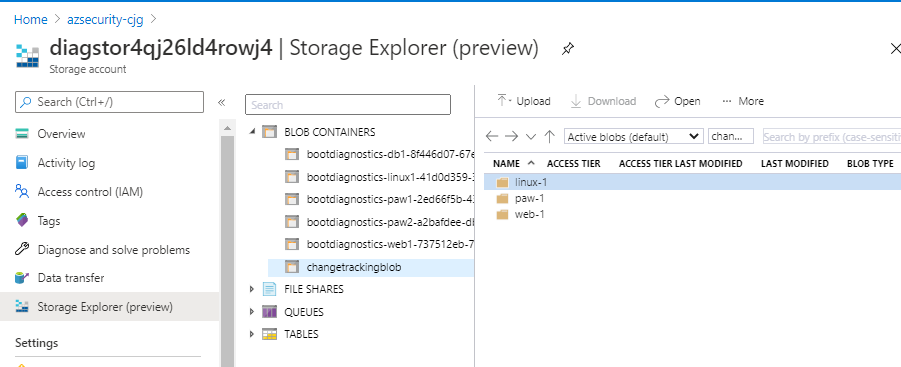

### Task 2: File Integrity Monitoring Automation

1. Browse to the **wssecuritySUFFIX** automation account
2. Under **Configuration Management**, select **Change tracking**
3. In the **Change Types** drop down filter, select **Files**
4. Select the **HOSTS** file, in the dialog, review the file changes

    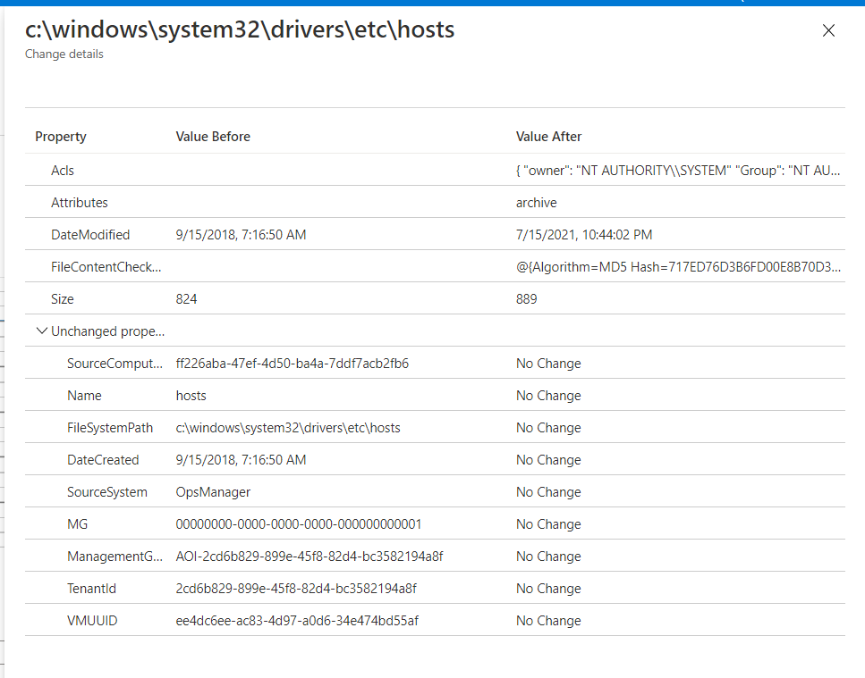

## Reference Links

- [Adaptive Application Controls](https://docs.microsoft.com/en-us/azure/security-center/security-center-adaptive-application)
- [File Integrity Monitoring](https://docs.microsoft.com/en-us/azure/security-center/security-center-file-integrity-monitoring)
