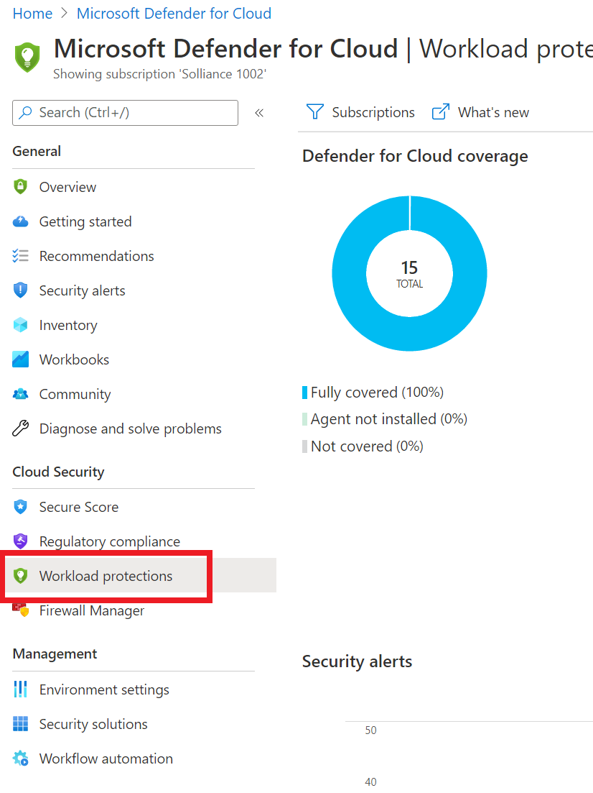
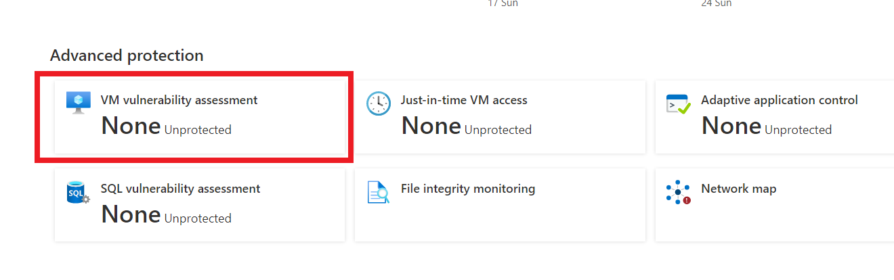
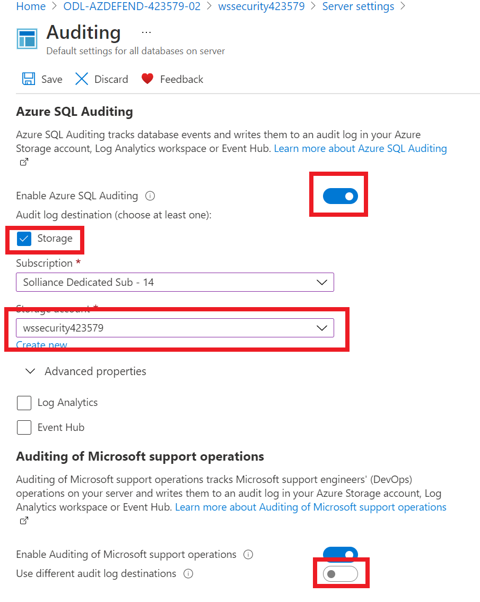
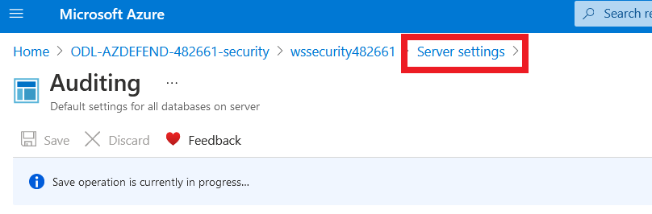
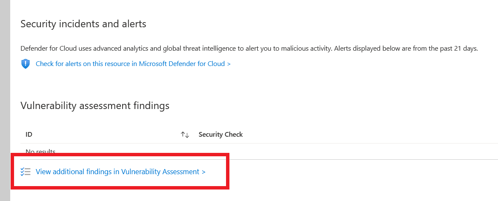
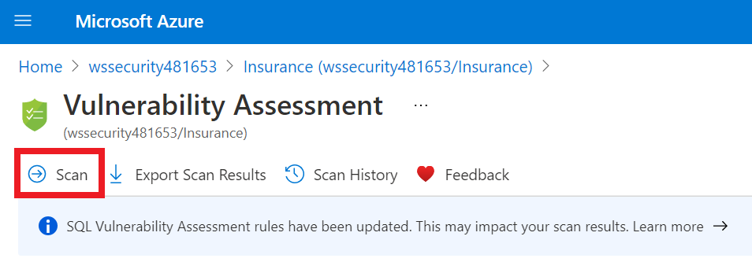
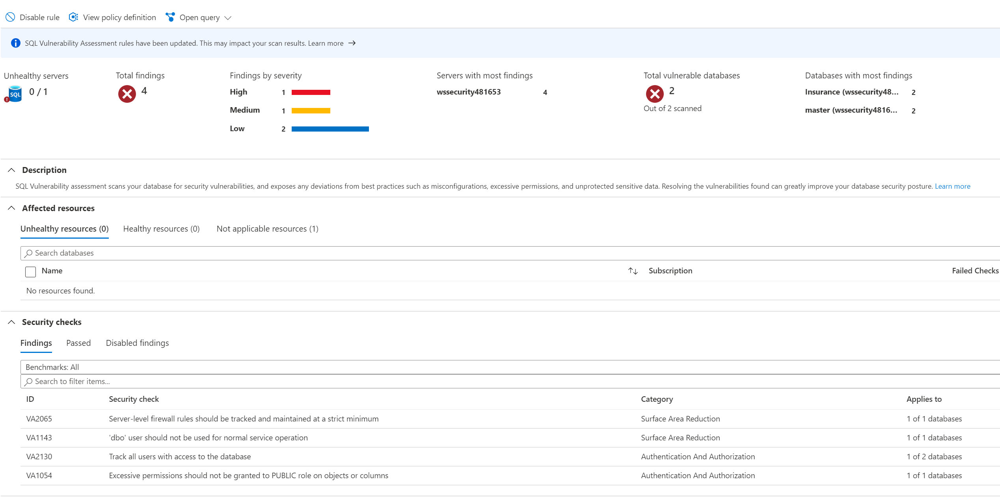
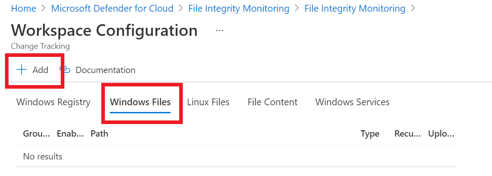
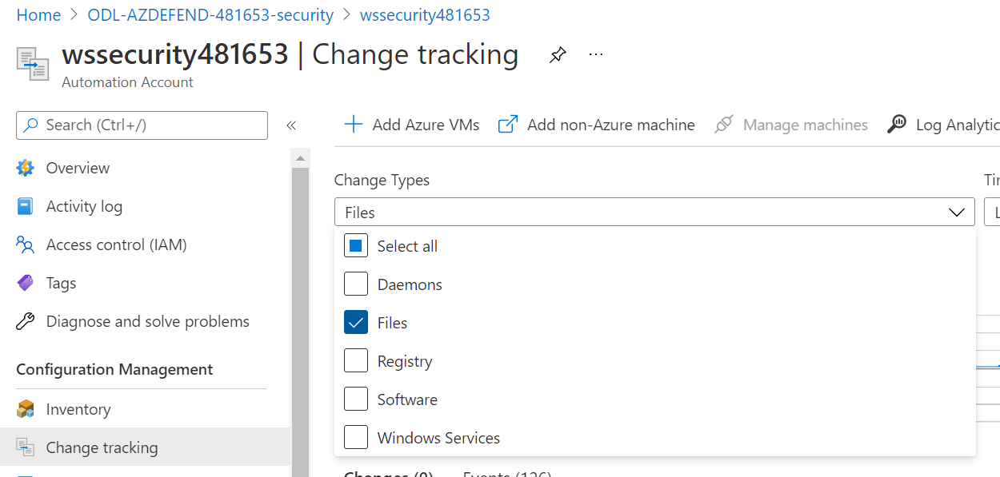

# Microsoft Defender for Cloud Setup : Lab 2 : Execute Microsoft Defender for Cloud Protections

## Exercise 1: VM Vulnerability Assessments

### Task 1: VM Vulnerability

1. Switch to the Azure Portal.

2. In the global search for and select the **Security Center**

3. Under **Cloud Security**, select **Workload protections**

    

4. Scroll down, under **Advanced protection**, select **VM vulnerability assessment**

    

5. Under **Unhealthy resources**, select the checkbox to select all the virtual machines

    

6. Select **Fix**
7. Select the **Deploy the integrated vulnerability scanner powered by Qualys** option

    

8. Select **Proceed**
9. In the dialog, select **Fix 6 resources**

  > **Note** After a few hours (up to 12), the agent will be installed on all selected machines and the assessment data will start to flow into the Security Center.

## Exercise 2: SQL Vulnerability Assessments

### Task 1: SQL Vulnerability

1. Switch to the Azure Portal and browse to the **-security** resource group

2. Browse to the **wssecuritySUFFIX** Azure Database for SQL instance

3. Under **Security**, select **Microsoft Defender for Cloud**, if you see **Enable Azure Defender for SQL**, select it. After a few minutes, you should see the recommendations and security alerts for the single SQL resource (if any).

    

4. Refresh the page, select the **(Configure)** link

    

5. Select the **Select storage account** link
  
    

6. Change the storage account to the **wssecuritySUFFIX** storage account

7. Toggle the periodic recurring checkbox to **On**

8. Set the email to the lab user email

9. Select the **Enable Auditing for better threats investigation experience** link

    

10. Toggle the **Enable Azure SQL Auditing** to **On**

11. Select **Storage** checkbox

12. Select the **wssecuritySUFFIX** log analytics workspace

13. Select **Log Analytics** checkbox

14. Select the **wssecuritySUFFIX** log analytics workspace

    

15. Toggle the **Enable Auditing of Microsoft support operations** to **On**

16. Again, select the **Log Analytics** checkbox, then select the lab subscription and the **wssecuritySUFFIX** workspace

17. Select **Save**

18. In the breadcrumb, select **Server settings**

    

19. Select **Save** again

20. Navigate to the **wssecuritySUFFIX** Azure Database for SQL server.

21. Under **Settings**, select **SQL Databases**

22. Select the **Insurance** database

23. Under **Security**, select **Microsoft Defender for Cloud**

24. Select **View additional findings in Vulnerability Assessment**

    

25. Select **Scan**

    

26. In the Azure Portal, open **Security Center**

27. Under **Cloud Security**, select **Workload Protections**

28. Scroll to the bottom, select **SQL Vulnerability Assessment**, after a few minutes, you should see all servers and database scan results across the subscription displayed.

    

## Exercise 3: File Integrity Monitoring

### Task 1: File Integrity Monitoring

1. Navigate back to the Security Center

2. In the blade menu, under **Cloud Security**, select **Workload protections**

3. Scroll to the bottom and select **File Integrity Monitoring**.

4. Select the **wssecuritySUFFIX** log workspace. If **Upgrade Plan** is displayed, select **Upgrade Plan**

   

   - Select **Try File Integrity Monitoring**.

   - Select the workspace only, then select **Upgrade**.

   - Select the **Continue without installing agents** link.

      

5. If displayed, select **Enable**, then select **Enable File Integrity Monitoring**. If not displayed, simply select the workspace.

   > **NOTE** This can take some time, but is typically within a few minutes

6. Refresh the File Integrity Monitoring page until you see the **settings** menu.
  
7. In the menu, select **Settings**.

    

8. Select the **Windows Files** tab.
9. Select **+Add**.

    

10. For the item name, type **HOSTS**.
11. For the path, type **c:\windows\system32\drivers\etc\\\***
12. For the path type, select **Folder**
13. Toggle **Recursion** to **On**
14. Toggle **Upload file content** to **True**
15. Select **Save**.

    

16. Select the **File Content** tab.
17. Select **Link**, then select the **wssecuritySUFFIX** storage account tied to your lab.

    > **NOTE** It will take 15-30 minutes for Log Analytics and its management packs to execute on all your VMs. As you may not have that much time with this lab, screen shots are provided as to what results you will eventually get.

    

18. Select **Save**
19. Switch to the Remote Desktop Connection to the **wssecuritySUFFIX-paw-1**.
20. Open **Event Viewer**.
21. Expand the **Applications and Services Logs**, then select **Operations Manager**.
22. Right-click **Operations Manager**, select **Filter Current Log**.
23. Wait for a new event with the event id of **5001** to be displayed.
24. Open the **c:\windows\system32\drivers\etc\hosts** file.
25. Add the following entry:

    ```cmd
    10.0.0.6    linux-2
    ```

26. Save the file.
27. After about 15-30 minutes, the Log Analytics workspace will start to pickup changes to your files, registry settings and windows services.
    - Switch to your **wssecuritySUFFIX** Log Analytics workspace
    - Under **General**, select **Logs**
    - Run the following query:

    ```output
    ConfigurationChange
    | where Computer == "paw-1"
    | where ConfigChangeType in("Files", "Registry")
    | order by TimeGenerated
    | render table
    ```

    

28. You will also start to see the file snapshots show up in the storage account.  Browse to the **wssecuritySUFFIX** storage, then select **changetrackingblob** container, then select the folder that matches the machine name:

    

### Task 2: File Integrity Monitoring Automation

1. Browse to the **wssecuritySUFFIX** automation account
2. Under **Configuration Management**, select **Change tracking**
3. In the **Change Types** drop down filter, select **Files**

    

4. Select the **HOSTS** file, in the dialog, review the file changes

    

    > **NOTE** It may take a few minutes for the changes to be displayed. You can continue on to the next set of labs and come back to check on the results later in the day.

## Reference Links

- [Adaptive Application Controls](https://docs.microsoft.com/en-us/azure/security-center/security-center-adaptive-application)
- [File Integrity Monitoring](https://docs.microsoft.com/en-us/azure/security-center/security-center-file-integrity-monitoring)
