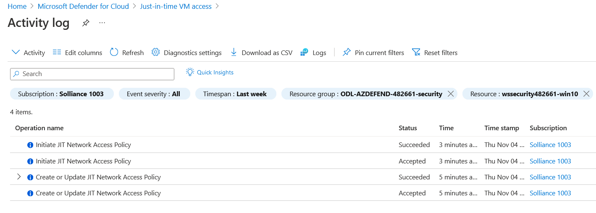
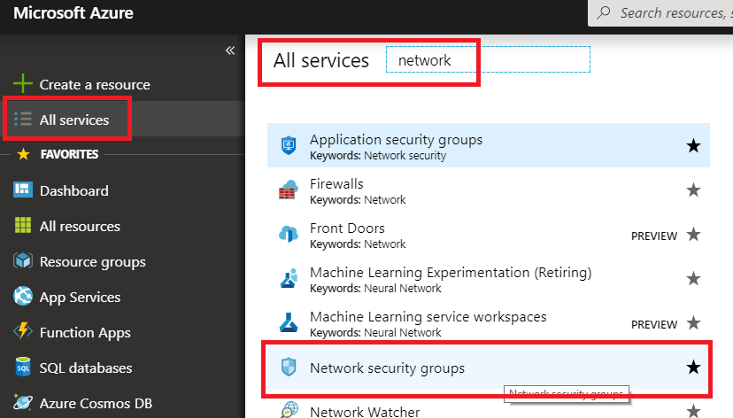

# Microsoft Defender for Cloud Setup : Lab 3 : Execute Microsoft Defender for Cloud Protections

## Exercise 1: Just In Time Access

### Task 1: Just In Time Access

1. In a browser, navigate to your Azure portal (<https://portal.azure.com>).

2. Search for **Microsoft Defender for Cloud**, select it

3. Under **Cloud Security** select **Workload Protections**.

4. Scroll to the bottom, select **Just-in-time VM Access**

5. Select the **Configured** tab, and verify the lab VMs are displayed.  If not, preform the following:

   - Select the **Not Configured** tab
     - If the VMs are displayed, then check the checkbox to select the lab VMs, and then select the **Enable JIT on X VMs** link, continue with the lab.
     - If the VMs are not displayed, select the **Unsupported** tab, then select the **wssecuritySUFFIX-win10** virtual machine.
     - Under **Settings**, select the **Connect**.
     - In the notification section at the top, select **To Improve security, enable just-in-time on this VM.**

        

6. In the configuration window that opens, review the settings, then select **Save**.

7. After a few minutes, you should see the virtual machines moved to the **Configured** tab.

### Task 2: Perform a JIT request

1. Select the **wssecuritySUFFIX-win10** virtual machine
2. Under **Settings**, select **Connect**
3. Select **Request access**.
4. After a few moments, you should see access approved.

    

5. Switch to the **Microsoft Defender for Cloud**
6. Select **Workload protections**
7. Select **Just in Time VM Access**
8. You should see the **Approved** requests have been incremented and the **Last Access** is set to **Active now.**.

    

    > **Note**  If you did not wait for your VMs and virtual networks to be fully provisioned via the ARM template, you may get an error.

9. Select the ellipses, then select **Activity Log**

    

    > **Note**: These entries will persist after you have deleted the VMs. You will need to manually remove them after VM deletion.

10. You will be able to see a history of who requests access to the virtual machines.

    

11. In the Azure Portal main menu, select **All Services**, then type **Network**, then select **Network security groups**.

    

12. In the filter textbox, type **paw-1-nsg**, then select the **paw-1-nsg** network security group.

13. Select **Inbound security rules.** You should now see inbound security rules set up by JIT Access.

    

## Exercise 2: Adaptive Application Controls

Note that it takes some time (24+ hours) for Adaptive Application Controls to become active on a newly created subscription and virtual machines.  You may not see the same results as in this lab, but screenshots are provided for reference.

### Task 1: Adaptive Application Controls

1. Switch to the Azure Portal.

2. In the global search, search for **Virtual Machines**, then select it

3. Select all virtual machines, then select **Services->Inventory**, ensure that all virtual machines are connected to the **wssecuritySUFFIX** workspace.  If not, do the following:

   - Select the **CUSTOM...** radio button, then browse for your **wssecuritySUFFIX** log analytics workspace

   - Select **Enable**

4. Select all virtual machines, then select **Services->Update Management**, ensure that all virtual machines are connected to the **wssecuritySUFFIX** workspace.  If not, do the following:

   - Select the **CUSTOM...** radio button, then browse for your **wssecuritySUFFIX** log analytics workspace

   - Select **Enable**

5. In the global search, search for and select **Security Center**.

6. In the blade menu, scroll to the **Cloud Security** section and select **Workload Protections**

7. Scroll to the bottom of the page, select **Adaptive application control**.

8. If prompted, select **Try Application Whitelisting**

   - If prompted, select your workspace, then click **Upgrade**

   - Select **Continue without installing agents**

9. You will likely have several groups displayed, find the one that has your newly created lab VMs.
  
    

10. Expand the **More applications** section, you should see that Google Chrome and Notepad++ were picked up and have Microsoft Certificated tied to them
  
    

11. Select **Audit**

12. Select the **Configured** tab, you should see the group state will move to **Auditing**.

13. After Security Center gathers enough data, eventually you will see alerts such as the following:

    

## Reference Links

- [Adaptive Application Controls](https://docs.microsoft.com/en-us/azure/security-center/security-center-adaptive-application)
- [Just in Time Access](https://docs.microsoft.com/en-us/azure/security-center/just-in-time-access-usage?tabs=jit-config-asc%2Cjit-request-asc)
