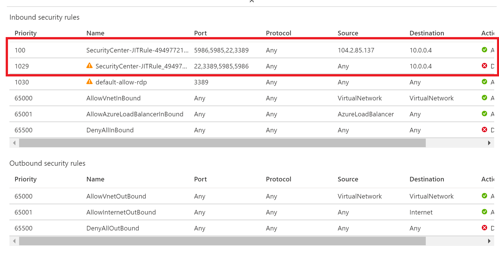

# Microsoft Defender for Cloud Setup : Lab 3 : Execute Microsoft Defender for Cloud Protections

## Exercise 1: Adaptive Application Controls

### Task 1: Adaptive Application Controls

1. Switch to the Azure Portal.

2. Search for Virtual Machines, then select it

3. Select all virtual machines, then select **Services->Inventory**, ensure that all virtual machines are connected to the **wssecuritySUFFIX** workspace.  If not, do the following
   1. Select the **CUSTOM...** radio button, then browse for your **wssecuritySUFFIX** log analytics workspace
   2. Select **Enable**

4. Select all virtual machines, then select **Services->Update Management**, ensure that all virtual machines are connected to the **wssecuritySUFFIX** workspace.  If not, do the following
   1. Select the **CUSTOM...** radio button, then browse for your **wssecuritySUFFIX** log analytics workspace
   2. Select **Enable**

5. Search for and select **Security Center**.

6. In the blade menu, scroll to the **Cloud Security** section and select **Azure Defender**

7. Scroll to the bottom of the page, select **Adaptive application control**.

8. If prompted, select **Try Application Whitelisting**
   1. If prompted, select your workspace, then click **Upgrade**
   2. Select **Continue without installing agents**

9. You will likely have several groups displayed, find the one that has your newly created lab VMs.
  
    

10. Expand the **More applications** section, you should see that Google Chrome and Notepad++ were picked up and have Microsoft Certificated tied to them
  
    

11. Select **Audit**
12. Select the **Configured** tab, you should see the group state will move to **Auditing**.
13. After Security Center gathers enough data, eventually you will see alerts such as the following:

    

## Exercise 2: Just In Time Access

### Task 1: Just In Time Access

1. In a browser, navigate to your Azure portal (<https://portal.azure.com>).
2. Search for **Security Center**, select it
3. Under **Cloud Security** select **Azure Defender**.
4. Scroll to the bottom, select **Just-in-time VM Access**
5. Select the **Configured** tab, and verify the lab VMs are displayed.  If not, select the **Not Configured** tab, and then check the checkbox to select the lab VMs, and then select the **Enable JIT on X VMs** link.
6. In the configuration window that opens, review the settings, then select **Save**.
7. After a few minutes, you should see the virtual machines moved to the **Configured** tab.

### Task 2: Perform a JIT request

1. Select the **wssecuritySUFFIX-paw-1** virtual machine, and then select **Request access**.

    

2. For each of the ports, select the **On** toggle button, notice how the default IP settings is **My IP**.

    

3. At the bottom of the dialog, select **Open ports**. After a few moments, you should now see the **APPROVED** requests have been incremented and the **Last Access** is set to **Active now.**.

    

    > **Note**  If you did not wait for your VMs and virtual networks to be fully provisioned via the ARM template, you may get an error.

4. Select the ellipses, then select **Activity Log**, you will be able to see a history of who requests access to the virtual machines.

    

    > **Note**: These entries will persist after you have deleted the VMs. You will need to manually remove them after VM deletion.

5. In the Azure Portal main menu, select **All Services**, then type **Network**, then select **Network security groups**.

    

6. In the filter textbox, type **paw-1-nsg**, then select the **paw-1-nsg** network security group.

7. Select **Inbound security rules.** You should now see inbound security rules set up by JIT Access.

    

## Reference Links

- [Adaptive Application Controls](https://docs.microsoft.com/en-us/azure/security-center/security-center-adaptive-application)
- [File Integrity Monitoring](https://docs.microsoft.com/en-us/azure/security-center/security-center-file-integrity-monitoring)
