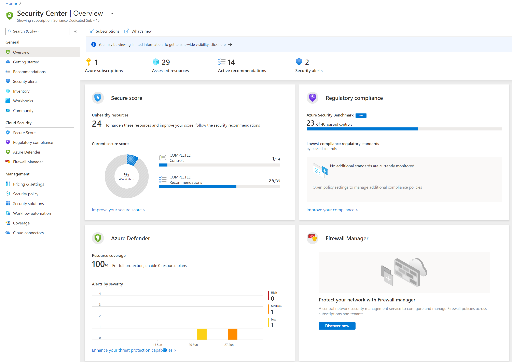
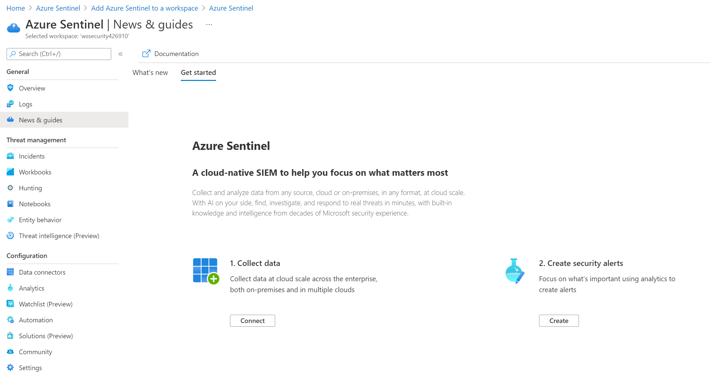
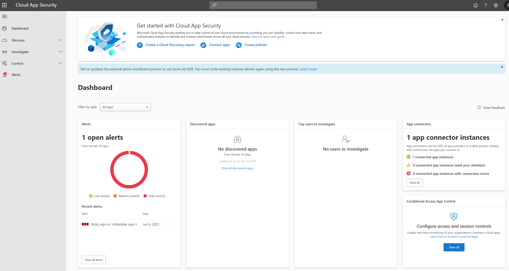
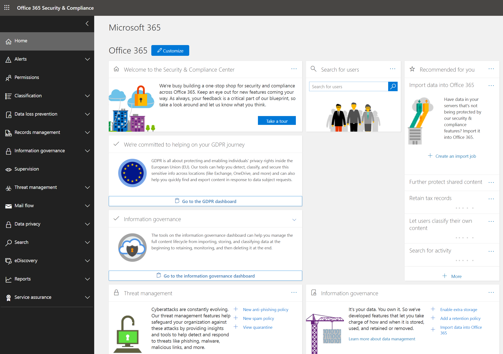
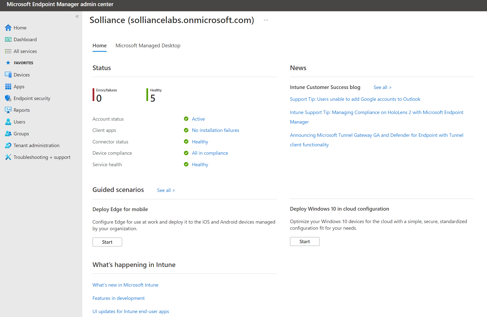
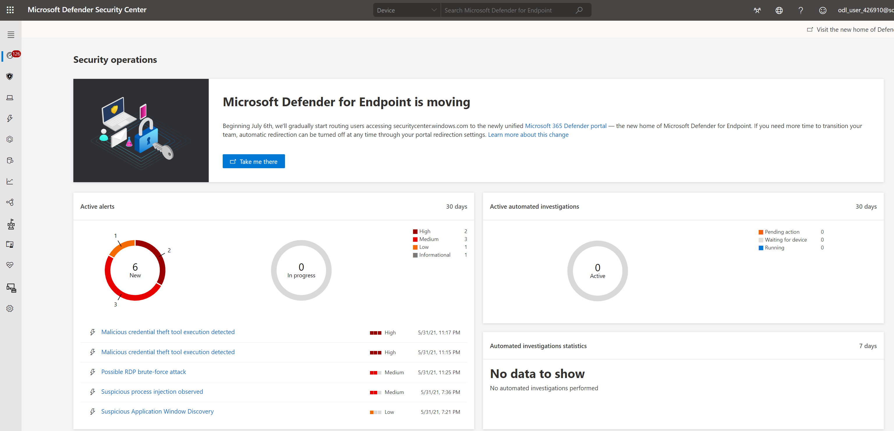
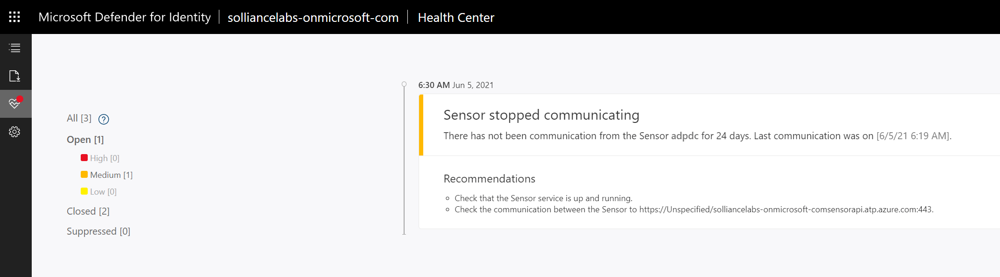
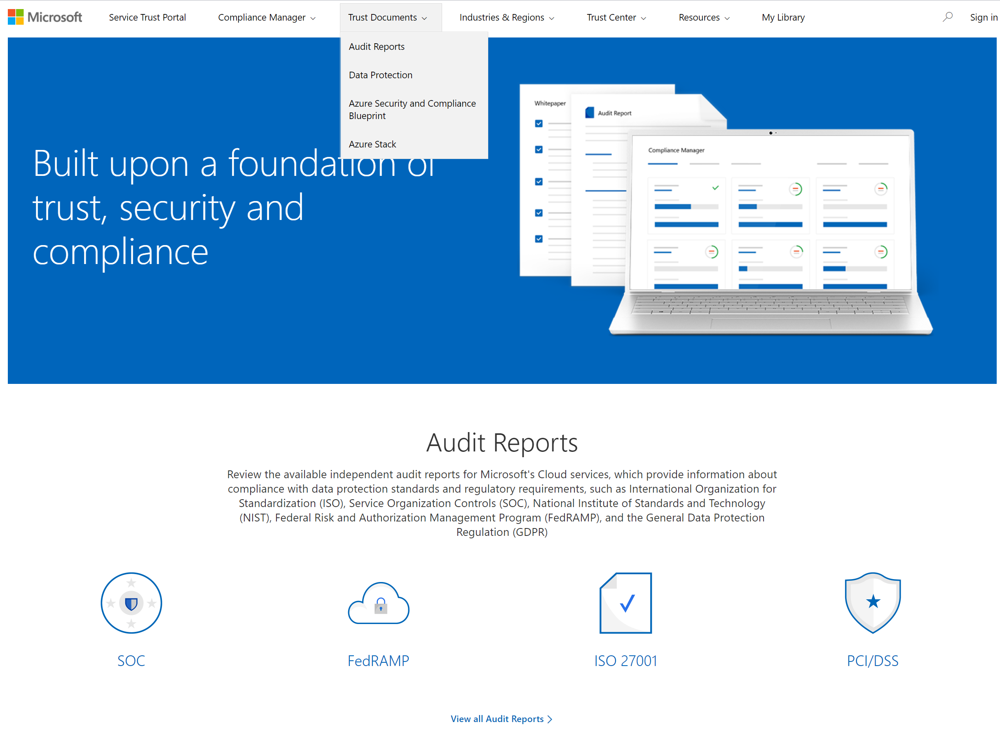

# Explore Security Portals (Optional)

## Exercise 1: Understand various Security Portals

Customers have immense flexibility when choosing what resources they would like to protect and how they will protect them. As a Microsoft Security consultant, you should be familiar will all the Security Portals

### Task 1: Microsoft Defender for Cloud

1. Open the Azure Portal
2. Search for **Microsoft Defender for Cloud**, select it
3. Review the portal

    

### Task 2: Azure Sentinel

1. Open the Azure Portal
2. Search for **Azure Sentinel**, select it
3. If not already created, select **Create**
4. Select the **wssecuritySUFFIX** log analytics workspace
5. Select **Add**
6. Review the portal

    

### Task 3: Cloud App Security

1. Open the [Portal](https://portal.cloudappsecurity.com/), review it.

    

### Task 4: M365 Security

1. Open the [Portal](https://protection.office.com/homepage), review it.

    

### Task 5: M365 Compliance

1. Open the [Portal](https://compliance.microsoft.com/homepage), review it.

    

### Task 6: Endpoint Management (Intune)

1. Open the [Portal](https://endpoint.microsoft.com), review it.

    

### Task 7: Microsoft Defender for Endpoint

1. Open the [Portal](https://securitycenter.microsoft.com), review it.

    

    > **NOTE** All Microsoft Defender for Endpoint settings will be migrated to https://security.microsoft.com in July 2021.

### Task 8: Microsoft Defender for Identity

1. Open the [Portal](https://portal.atp.azure.com/), review it.

    > **NOTE** You may need to create the instance first before you can browse the portal

    

### Task 9: Service Trust Portal

1. Open the [Portal](https://servicetrust.microsoft.com/), review it.

    
