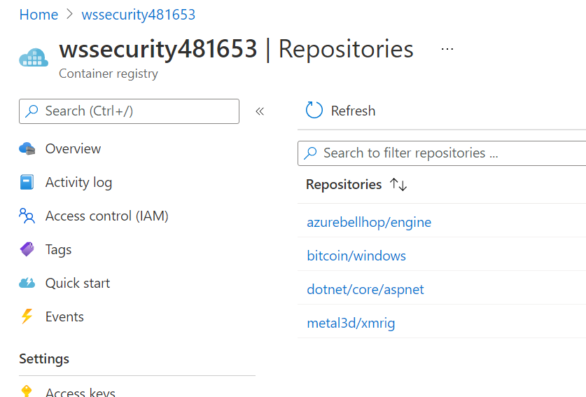
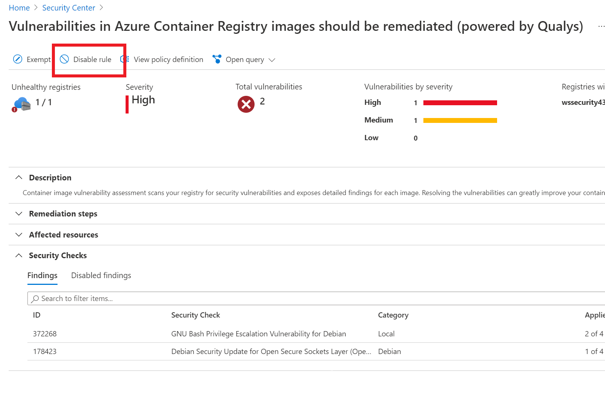
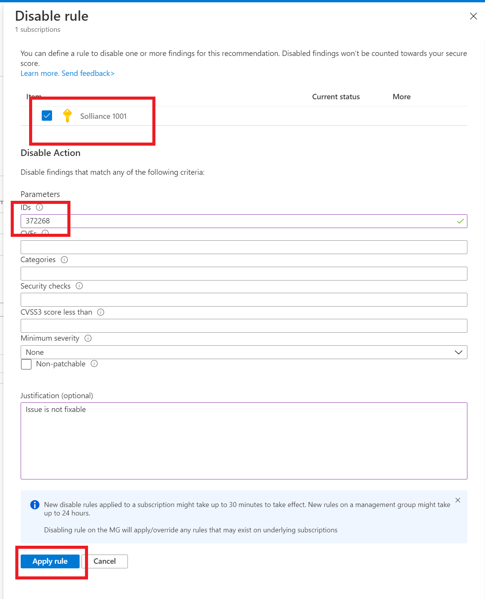
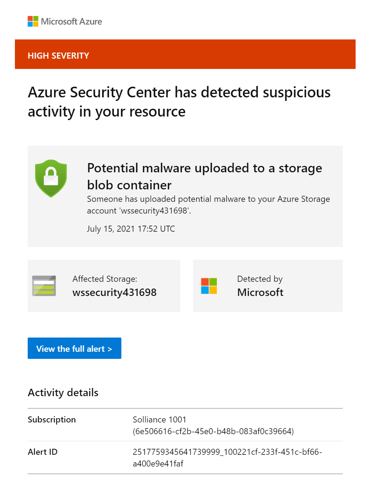
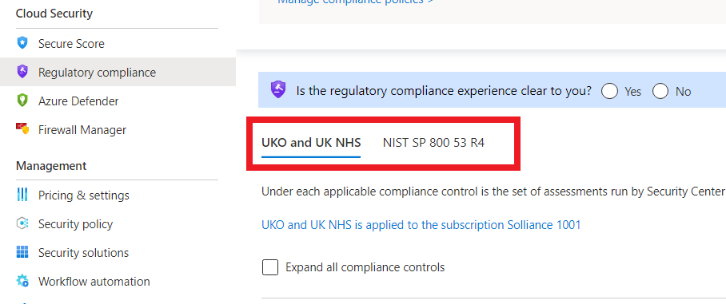

# Azure Defender Setup : Lab 2 : Execute Azure Defender Protections

## Exercise 1: Container and Container Image Scanning

### Task 1: Container and Container Image Scanning

1. Log in to the **wssecuritySUFFIX-paw-1** virtual machine
2. Open the Azure Portal to your lab environment
3. Navigate to your lab resource group
4. Open the **wssecuritySUFFIX** container registry
5. Under **Services**, select **Repositories**, notice there are no images
6. Under **Settings**, select **Access keys**
7. Copy the username and password for later use

    

8. Browse to the **wssecuritySUFFIX-linux-1** virutal machine
9. Under **Settings**, select **Connect**
10. Select **Request access**
11. Open a powerShell window, log in to the **wssecuritySUFFIX-linux-1** virtual machine by running the following:

    ```bash
    ssh wsuser@10.0.0.5
    ```

12. When prompted, type `yes`, then enter the lab password

13. In the new SSH session, run the following command. This will push an image to the container registry.

    ```bash
    sudo apt-get update

    sudo apt-get install pass gnupg2

    sudo apt-get install apt-transport-https ca-certificates curl gnupg lsb-release

    sudo curl -fsSL https://download.docker.com/linux/ubuntu/gpg | sudo gpg --dearmor -o /usr/share/keyrings/docker-archive-keyring.gpg

    echo "deb [arch=amd64 signed-by=/usr/share/keyrings/docker-archive-keyring.gpg] https://download.docker.com/linux/ubuntu $(lsb_release -cs) stable" | sudo tee /etc/apt/sources.list.d/docker.list > /dev/null
    
    sudo apt-get install docker-compose

    sudo apt-get install make

    sudo docker pull docker.io/azurebellhop/engine:v0.4

    sudo docker pull wernight/bfgminer

    sudo docker pull metal3d/xmrig:latest

    sudo docker pull mcr.microsoft.com/dotnet/core/aspnet:2.1

    ```

14. Push the image to your Azure Container Registry, replace the name, username and password:

    ```bash
    sudo docker login {acrName}.azurecr.io -u {username} -p {password}

    sudo docker tag docker.io/azurebellhop/engine:v0.4 {acrName}.azurecr.io/azurebellhop/engine:v0.4

    sudo docker tag wernight/bfgminer {acrName}.azurecr.io/bitcoin/windows

    sudo docker tag metal3d/xmrig {acrName}.azurecr.io/metal3d/xmrig

    sudo docker tag mcr.microsoft.com/dotnet/core/aspnet:2.1 {acrName}.azurecr.io/dotnet/core/aspnet:2.1

    sudo docker push {acrName}.azurecr.io/azurebellhop/engine:v0.4

    sudo docker push {acrName}.azurecr.io/bitcoin/windows

    sudo docker push {acrName}.azurecr.io/metal3d/xmrig

    sudo docker push {acrName}.azurecr.io/dotnet/core/aspnet:2.1

    ```

15. Switch to the Azure Portal, browse to the **wssecuritySUFFIX** Azure Container Registry
16. Under **Services**, select **Repositories**, you should see the new images displayed

    

17. Under **Services**, select **Security**, ensure the setting is set to **On**

    

18. Browse to **Security Center**
19. Under **Cloud Security**, select **Azure Defender**
20. Select **Container Image scanning**, you should see one or more recommendations displayed. Wait for their to be 4 images to be scanned.  This can take a few minutes.

    

21. Once the findings are displayed, notice some have patches availabe.
22. For the `azurebellhop` image `Debian Security Update for Open Secure Sockets Layer` recommendations, select the issue
23. Review the links that help with remediation.  If you like, perform the remediation steps and then re-push the image to the container registry to resolve the image issue.
24. For the `azurebellhop` image `GNU Bach Prviliedges Escalation...` recommendation, select it.  

    

25. You should see the images that are affected.

    

26. Copy the Findings ID
27. In the top navigation, select **Disable Rule**.  You may need to refresh the page.

    

28. Select the lab subscription
29. For the IDs, enter the finding ID you just copied
30. For the Justification, type **Issue is not fixable**

    

31. Select **Apply rule**

## Exercise 2: Azure Defender for Storage (Detecting bad actors)

### Task 1: Detecting Bad Actors

1. Switch to the Azure Portal
2. Browse to the **wssecuritySUFFIX** storage account
3. Under **Data storage**, select **Containers**
4. Select **sqlimport** folder
5. Right-click the **Insurance.bacpac** file, select **Generate SAS**
6. Select **Generate SAS token and URL**
7. Copy the `Blob SAS URL`
8. Open the Tor Browser (you should see a link on your desktop)
9. Select **Connect**
10. Paste the `Blob SAS URL` that you previously copied, press **ENTER**
11. Select **Download file**
12. Select **Save File**, then select **Save**

    > **Note** After an hour you will see an alert in Security Center

    

## Exercise 3: Azure Defender for Storage (Detecting malware)

### Task 1: Setup Logic App

1. Switch to the Azure Portal
2. Browse to the `Ask-Remove-MalwareBlob` logic app
3. Under **Development Tools**, select **API connections**
4. Select the **wssecurity-asc** connection
5. Select **Edit API Connection**
6. Select **Authorize**, login using your lab credentials
7. Select **Save**
8. Select the **wssecurity-o365** connection
9. Select **Edit API Connection**
10. Select **Authorize**, login using your lab credentials
11. Select **Save**
12. Select **Edit**
13. Review the logic app
14. Under **Settings**, select **Identity**
15. For the system assigned identity, select **Azure role assignments**
16. Select **Add role assignment**
17. For the scope, select **Storage**
18. Select the lab subscription
19. Select the **wssecuritySUFFIX** storage account
20. Select the **Storage Blob Data Owner** role
21. Select **Save**
22. Select **Add role assignment**
23. For the scope, select **Subscription**
24. Select the lab subscription
25. Select the **Security administrator** role
26. Select **Save**

### Task 2: Setup Automation Trigger

1. Browse to Azure Security Center
2. Under **Management**, select **Workflow automation**
3. For the name, type `Ask-Remove-MalwareBlob`
4. Select the ***-security** resource group
5. For the **Select Security Center data types**, select **Threat detection alerts**
6. For the alert name contains, type **Potential malware uploaded to a storage blob container**
7. For the logic app, select `Ask-Remove-MalwareBlob`
8. Select **Create**

### Task 3: Upload malware

1. Browse to the **wssecuritySUFFIX** storage account
2. Under **Data storage**, select **Containers**
3. Select the `sqlimport` container
4. Select **Upload**
5. Extract all the contents of the `/artifacts/day-01/eicarcom2.zip` zip file
6. Upload the `/artifacts/day-01/eicar.exe` file to the storage account
7. After a few hours, you should see a new security alert in Security Center

    

8. Open https://outlook.office.com/mail/
9. In your email, you will receive an approval email asking if you want to delete the malware file

    

## Exercise 4: Industry and Regulatory Standards

### Task 6: Add Industry and Regulatory standards

1. Switch to the Azure Portal
2. Select **Security Center**
3. Under **Cloud Security**, select **Regulatory compliance**
4. Select **Manage compliance policies>**
5. Select your lab subscription
6. Select **Add more standards**
7. For the **NIST SP 800-53 R4**, select **Add**
8. Select **Review + create**
9. Select **Create**
10. You should now see the new policy displayed, browse back to the Security Center Regulatory compliance blade
11. You should now see the tab for **NIST SP 800-53 R4** displayed

    

## Reference Links

- TODO