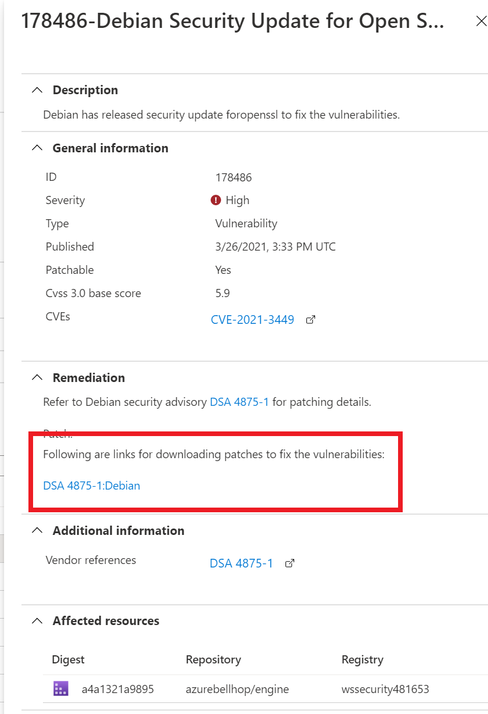

# Microsoft Defender for Cloud Setup : Lab 2 : Execute Microsoft Defender for Cloud Protections

## Exercise 1: Container and Container Image Scanning

### Task 1: Container and Container Image Scanning

1. Log in to the **wssecuritySUFFIX-paw-1** virtual machine
2. Open the Azure Portal to your lab environment
3. Navigate to your lab resource group
4. Select the **wssecuritySUFFIX** container registry

    

5. Under **Services**, select **Repositories**, notice there are no images
6. Under **Settings**, select **Access keys**
7. Copy the username and password for later use

    

8. Browse to the **wssecuritySUFFIX-linux-1** virtual machine
9. Under **Settings**, select **Connect->SSH**
10. Select **MyIP**, then select **Request access**
11. Open a powerShell window, log in to the **wssecuritySUFFIX-linux-1** virtual machine by running the following:

    ```bash
    ssh wsuser@10.0.0.5
    ```

12. When prompted, type `yes`, then enter the lab password

13. In the new SSH session, run the following command. This will push several images to the Azure container registry.

    ```bash
    sudo apt-get update

    sudo apt-get install pass gnupg2 -y

    sudo apt-get install apt-transport-https ca-certificates curl gnupg lsb-release -y

    sudo curl -fsSL https://download.docker.com/linux/ubuntu/gpg | sudo gpg --dearmor -o /usr/share/keyrings/docker-archive-keyring.gpg

    echo "deb [arch=amd64 signed-by=/usr/share/keyrings/docker-archive-keyring.gpg] https://download.docker.com/linux/ubuntu $(lsb_release -cs) stable" | sudo tee /etc/apt/sources.list.d/docker.list > /dev/null
    
    sudo apt-get install docker-compose -y

    sudo apt-get install make -y

    sudo docker pull docker.io/azurebellhop/engine:v0.4

    sudo docker pull wernight/bfgminer

    sudo docker pull metal3d/xmrig:latest

    sudo docker pull mcr.microsoft.com/dotnet/core/aspnet:2.1

    ```

14. Push the image to your Azure Container Registry, be sure to replace the `acrName`, `username` and `password`:

    ```bash
    sudo docker login {acrName}.azurecr.io -u {username} -p {password}

    sudo docker tag docker.io/azurebellhop/engine:v0.4 {acrName}.azurecr.io/azurebellhop/engine:v0.4

    sudo docker tag wernight/bfgminer {acrName}.azurecr.io/bitcoin/windows

    sudo docker tag metal3d/xmrig {acrName}.azurecr.io/metal3d/xmrig

    sudo docker tag mcr.microsoft.com/dotnet/core/aspnet:2.1 {acrName}.azurecr.io/dotnet/core/aspnet:2.1

    sudo docker push {acrName}.azurecr.io/azurebellhop/engine:v0.4

    sudo docker push {acrName}.azurecr.io/bitcoin/windows

    sudo docker push {acrName}.azurecr.io/metal3d/xmrig

    sudo docker push {acrName}.azurecr.io/dotnet/core/aspnet:2.1

    ```

15. Switch to the Azure Portal, browse to the **wssecuritySUFFIX** Azure Container Registry

16. Under **Services**, select **Repositories**, you should see the new images displayed

    

17. Under **Services**, select **Security**, ensure the setting is set to **On**

    

18. Browse to **Microsoft Defender for Cloudr**

19. Under **Cloud Security**, select **Workload protections**

20. Select **Container Image scanning**, you should see one or more recommendations displayed. Wait for their to be 4 images to be scanned.  This can take a few minutes.

    

21. Once the findings are displayed, notice some have patches available.
22. For the `azurebellhop` image `Debian Security Update for Open Secure Sockets Layer` recommendation, select the issue
23. Review the links that help with remediation.  If you like, perform the remediation steps and then re-push the image to the container registry to resolve the image issue.

    

24. For the `azurebellhop` image `GNU Bach Prviliedges Escalation...` recommendation, select it.  

    

25. You should see the images that are affected.

    

26. Copy the Findings ID
27. In the top navigation, select **Disable Rule**.  You may need to refresh the page.

    

28. Select the lab subscription
29. For the IDs, enter the finding ID you just copied
30. For the Justification, type **Issue is not fixable**

    

31. Select **Apply rule**

## Exercise 2: Microsoft Defender for Cloud for Storage (Detecting bad actors)

### Task 1: Detecting Bad Actors

1. Switch to the Azure Portal
2. Browse to the **wssecuritySUFFIX** storage account
3. Under **Data storage**, select **Containers**
4. Select **sqlimport** folder
5. Right-click the **Insurance.bacpac** file, select **Generate SAS**

    

6. Select **Generate SAS token and URL**
7. Copy the `Blob SAS URL`

    

8. Open the Tor Browser (you should see a link on your paw-1 desktop).  If you do not, open a PowerShell window and run `choco install tor-browser --ignoredetectedreboot --force`
9. Select **Connect**, it can take a few moments to connect
10. Paste the `Blob SAS URL` that you previously copied, press **ENTER**
11. Select **Download file**
12. Select **Save File**, then select **Save**

    > **Note** After an hour you will see an alert in Microsoft Defender for Cloud

    

## Exercise 3: Microsoft Defender for Cloud for Storage (Detecting malware)

### Task 1: Setup Logic App

1. Switch to the Azure Portal, navigate to the lab resource group
2. Select to the `Ask-Remove-MalwareBlob` logic app

    

3. Under **Development Tools**, select **API connections**
4. Select the **wssecurity-asc** connection

   

5. Select **Edit API Connection**
6. If displayed, select **Authorize**, login using your lab credentials
7. Select **Save**
8. Select the **wssecurity-o365** connection
9. Select **Edit API Connection**
10. If displayed, select **Authorize**, login using your lab credentials

    

11. Select **Save**
12. Browse back to the logic app and select the **Overview** menu item
13. In the top navigation, select **Edit**, review the logic app
14. Exit the editor mode
15. Under **Settings**, select **Identity**
16. For the system assigned identity, select **Azure role assignments**

    

17. Select **Add role assignment**
18. For the scope, select **Storage**
19. Select the lab subscription
20. Select the **wssecuritySUFFIX** storage account
21. Select the **Storage Blob Data Owner** role

    

22. Select **Save**
23. Select **Add role assignment**
24. For the scope, select **Subscription**
25. Select the lab subscription
26. Select the **Security Admin** role
27. Select **Save**

### Task 2: Setup Automation Trigger

1. Browse to **Microsoft Defender for Cloud**
2. Under **Management**, select **Workflow automation**
3. In the top navigation, select **Add workflow automation**

    

4. For the name, type `Ask-Remove-MalwareBlob`
5. Select the ***-security** resource group
6. For the **Defender for Cloud data types**, select **Security alerts**
7. For the `alert name contains`, type **Potential malware uploaded to a storage blob container**
8. For the logic app, select `Ask-Remove-MalwareBlob`

    

9. Select **Create**

### Task 3: Upload malware

> Note that Microsoft Defender will attempt to block you on this lab task.  You will need to open Defender and allow the files and actions as you proceed.  This may happen multiple times depending on the path you take.

1. On the **paw-1** virtual machine, extract all the contents of the `c:/labfiles/workshop/artifacts/day-02/eicarcom2.zip` zip file until you get to the .exe file.

    > NOTE:  You can also find this file on the eicar site : https://www.eicar.org/?page_id=3950

2. Browse to the **wssecuritySUFFIX** storage account
3. Under **Data storage**, select **Containers**
4. Select the `sqlimport` container
5. Select **Upload**
6. Upload the `/artifacts/day-02/eicar.exe` file to the storage account
7. After a few hours, you should see a new security alert in Microsoft Defender for Cloud

    

8. Open https://outlook.office.com/mail/
9. In your email, you will receive an approval email asking if you want to delete the malware file

    

## Exercise 4: Industry and Regulatory Standards

### Task 6: Add Industry and Regulatory standards

1. Switch to the Azure Portal
2. Select **Microsoft Defender for Cloud**
3. Under **Cloud Security**, select **Regulatory compliance**
4. Select **Manage compliance policies**

    

5. Select your lab subscription
6. Under **Settings**, select **Security policy**
7. Select Under **Industry and regulation standards**, select **Add more standards**

    

8. For the **NIST SP 800-53 R4**, select **Add**

    

9. Select **Review + create**
10. Select **Create**
11. You should now see the new policy displayed
12. Browse back to the Microsoft Defender for Cloud Regulatory compliance blade
13. You should now see the tab for **NIST SP 800-53 R4** displayed

    

## Reference Links

- [Microsoft Defender for container registries](https://docs.microsoft.com/en-us/azure/security-center/defender-for-container-registries-introduction)
- [Introduction to Microsoft Defender for Storage](https://docs.microsoft.com/en-us/azure/security-center/defender-for-storage-introduction)
- [Customize the set of standards in your regulatory compliance dashboard](https://docs.microsoft.com/en-us/azure/security-center/update-regulatory-compliance-packages)
