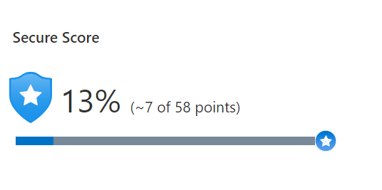

# Microsoft Defender for Cloud Setup : Lab 6 : Clearing Recommendations

## Exercise 1: Clearing Recommendations

### Task 1: Clearing Recommendations

1. Switch to Azure Security Center
2. Under **General**, select **Recommendations**
3. Review your **Secure Score**
  
    

4. Scroll down to the **Controls** section, review each of the recommendations

    

5. Resolve as many controls and recommendations as possible **without disabling them**

6. Compare your scores to other workshop attendees.
