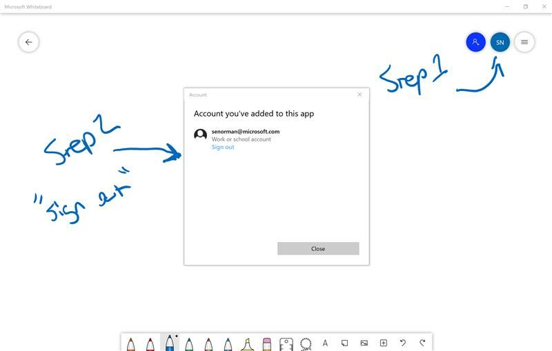

# Attendee Experience FAQ

### **Q**: _I'm on a Mac. Can I access the whiteboard?_

**A**: If you use the whiteboard link for your table group, you should be able to log in via the web experience that runs in the browser. In this experience, you will be unable to add text or move shapes but will be able to watch and draw with your mouse or touch input.

---

### **Q**: _I don’t see the whiteboard content when I log in_

**A**: You might be logged in with your personal account.

- Click the circular icon with your current login
- Click sign out
- Sign in with the cloud lab login using the "other work / school" option

---
